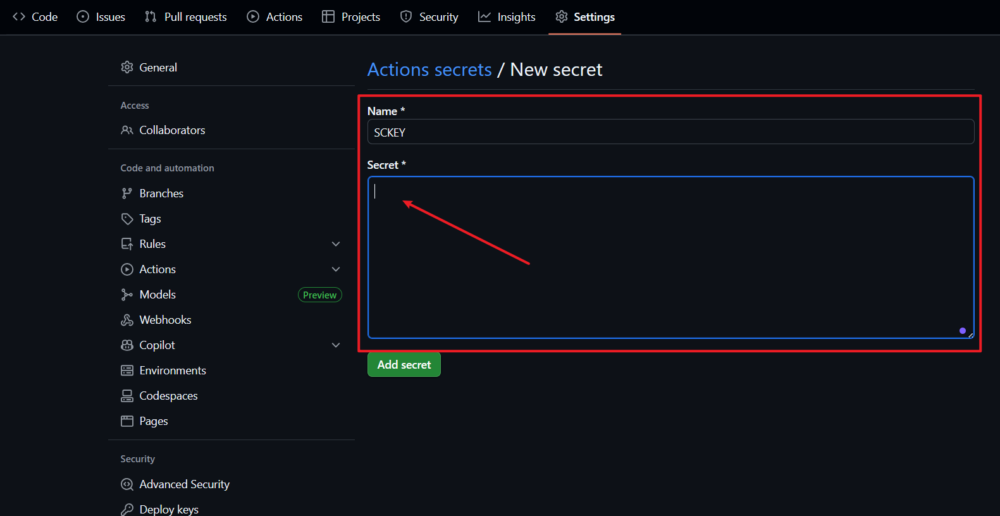

# 🔥 CVE Push Service | 自动化漏洞情报推送

  </a>
  </a>
  

> ⚡ 面向网络安全从业者的 **漏洞实时情报推送工具**  
> 包含实时监控多种漏洞相关的功能，并通过 **[Server酱3](https://sc3.ft07.com/)** 第一时间推送到您的设备，帮助您在应急响应与漏洞研究等场合中抢占先机。  

**中文** | **[English](README-EN.md)**

---

## 🚀 功能亮点

- ✅ **实时高危漏洞监控**：自动获取 [NVD](https://nvd.nist.gov/) 最新漏洞情报高风险漏洞
- ✅ **实时POC/EXP监控**：Github POC/EXP漏洞仓库
- ✅ **智能翻译**：集成有道翻译 API，支持漏洞描述中文化  
- ✅ **去重存储**：使用 Artifact 存储数据库，避免重复推送  
- ✅ **日志管理**：支持日志文件轮转，方便审计与追溯  
- ✅ **自动化运行**：支持 GitHub Actions 定时任务，方便省心，0 运维成本

---

⚠️ 点击展开：<strong>Fork 用户必读</strong>

 

最近有很多第一次接触 GitHub 的新用户使用本项目，因此特别补充这个说明。

**问题**：如果你是通过 **Fork** 使用本项目，你看到的可能是旧版文档。

**原因**：Fork 时会复制当时的文档版本，但原项目可能已更新。

**👉 [点击查看最新官方文档](https://github.com/hijack1r/CVE_PushService)**

**如何判断？** 看页面顶部的仓库地址：
- `github.com/你的用户名/CVE_PushService` ← 你 fork 的版本
- `github.com/hijack1r/CVE_PushService` ← 最新官方版本

---

## 🛠️ 使用方法

### 1. 准备工作

- Fork 本项目，Fork 后你的账号下会存在一个同样的项目（接下来的操作将在你自己的项目中进行）

- 直接从手机应用商店搜索`Server酱`下载安装，或访问 [Server酱3](https://sc3.ft07.com/) 点击APP下载。
- 下载app后注册账号，登录官网 [Server酱3](https://sc3.ft07.com/) 微信扫码后即可获取`SendKey`

### 2. 配置 SendKey 与 GithubToken

本仓库已内置 GitHub Actions 工作流（[AutoCVE.yml](./workflows/AutoCVE.yml) ）。
你只需在仓库 Settings → Secrets 中配置以下变量：
- SCKEY : 你刚注册的 Server酱3 SendKey（注意！前后不要有空格回车）

- Github Token：
  - 点击链接前往 [新建令牌](https://github.com/settings/tokens/new) 页面
  - 设置备注GH_TOKEN，选择“repo”，将过期时间设置为“无过期时间”，点击“确定” Generate token，并务必复制并保存您的令牌。
  - 最后同上述方法一样，在 Settings → Secrets 中配置此变量。

### 3. GitHub Actions 自动化运行

- 点击 `Actions` 进入运行页面，点击 `I understand my workflow` 按钮。
- 自动刷新后左侧出现 `Auto CVE Push Service` 流程。
- 点击 `Auto CVE Push Service` 流程，点击 `Enable Workflow` 按钮。
- 给自己的项目点击两次 `Star` （Fork后你自己的项目）启动Action。
- 再点击上面的 `Actions` 选择 `Auto CVE Push Service` 看看有没有报错。
- 没有报错的话Server酱里应该就会有推送通知了（记得打开Server酱App通知权限）
- 其他新更新的功能重复上述操作即可，随着功能的增加后续考虑将所有功能合并，避免操作繁琐。
- 推推送效果示例：

### 注意

- 默认是每天早上 UTC 0:00 **（北京时间 8:00）**开始自动检测**24小时**内是否有新的高危漏洞曝出，如果您想修改，可以在AutoCVE.yml中修改。实际执行时间：每天上午 ≈8:00~8:30（受GitHub队列影响）
- 由于本项目中使用 `GitHub Actions` 的 `Artifact` 来存储数据库（vulns.db）。`Artifact`是存储在GitHub仓库的`Actions`页面下的，与代码仓库分离。因此，当你们fork项目时，只能复制代码，但不会复制`Artifact`。这意味着：
  - 每个fork的项目在首次运行时，由于没有历史数据库，会从头开始创建一个新的`vulns.db`。（APP可能会收到24小时内的多条通知，不要惊慌）
  - 每个fork的项目在后续运行中，会使用自己工作流生成的`Artifact`（即自己保存的数据库），不会互相影响。
- 运行方式：
   - 启动 Action 时自动首次触发，后续工作流会在每日北京时间 8:00 自动运行
   - 或手动触发测试：Actions → Auto CVE Monitor → Run workflow
---

⚡ 如果本项目对你有帮助，请点一个 ⭐ Star 支持作者！
 

---

## 📅 更新日志

> 👨🏻‍🔧不定期持续更新，如有建议和问题可提Issues，将尽快实现与优化。

### 2025/11/21 - v1.1.0

- **新增Github漏洞仓库监听功能**：自动监听新发布或新更新的漏洞仓库（POC/EXP）
- 支持识别仓库状态，精准推送。
  - **status="new"**（新仓库）您可以专注于新发现的仓库，而不需要处理频繁更新的仓库，这样可以减轻信息的冗余。
  - **status="updated"**（更新仓库）如果漏洞的更新对您非常重要，推送 status="updated" 的仓库有助于实时跟踪这些漏洞的修复进展或新发现的相关信息，同时更新的仓库也可能包含新的 CVE、EXP、POC 信息，推送更新通知会让您全面了解漏洞的演变。
- 添加黑名单功能
- 独立各个功能的通知模板
- 优化项目结构

### 2025/08/31 - v1.0.0

- 🎉 首次发布：支持高危漏洞自动推送，集成有道翻译API。

> TODO:
- 监听国内外各大厂商漏洞页面
- 监听各大优质漏洞博客，筛选出影响特别大且被各大厂商严重告警的高危漏洞

---

## 💡 致谢

- 感谢 [Server酱3](https://sc3.ft07.com/) 提供稳定的消息推送服务。
- 感谢 [NVD](https://nvd.nist.gov/) 提供权威的漏洞情报源。
- 翻译由 **有道开放平台** 提供。

