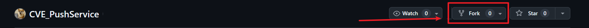
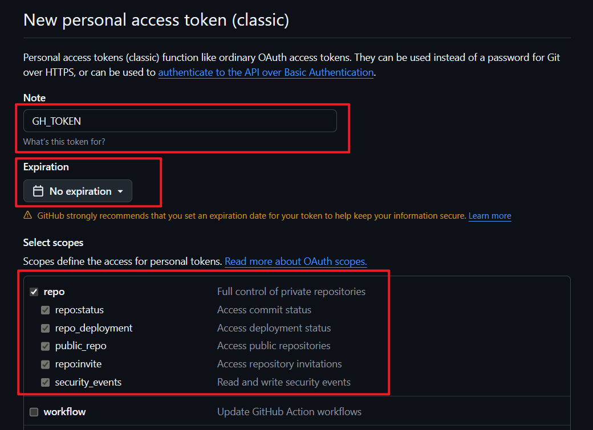
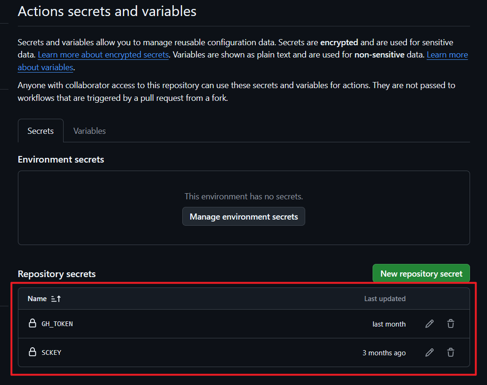
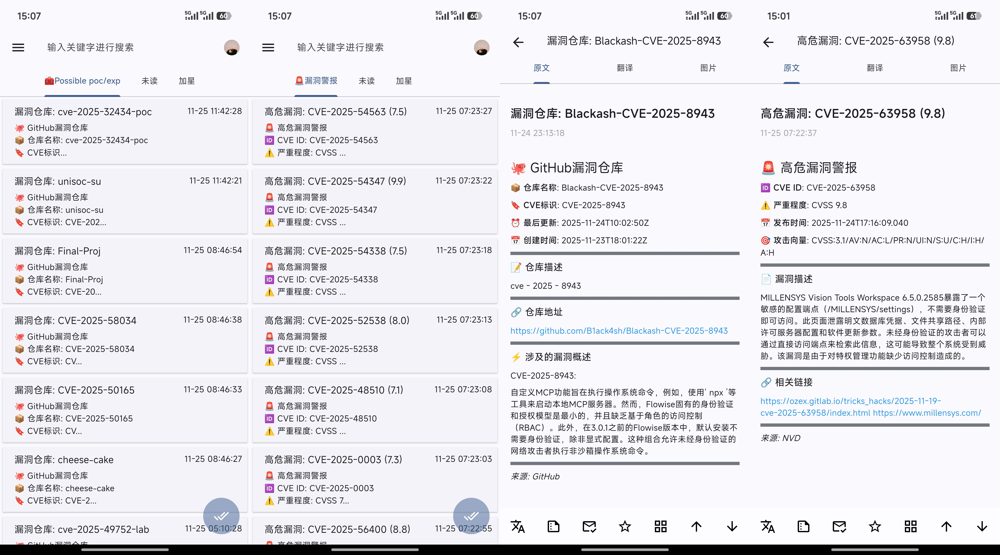

# 🔥 CVE Push Service | Automated Vulnerability Intelligence Push

<p align="center">

  </a>
  </a>
  [](https://github.com/hijack1r/CVE_PushService)

</p>

> ⚡ A **real-time vulnerability intelligence push tool** for cybersecurity professionals  
> It includes various functions for real-time vulnerability monitoring and pushes the information to your device via **[Server酱3](https://sc3.ft07.com/)**, helping you take the lead in emergency response and vulnerability research.

<div align="left">

**[Chinese](README.md)** | **English**

</div>

---

## 🚀 Key Features

- ✅ **Real-time High-Risk Vulnerability Monitoring**: Automatically fetches the latest high-risk vulnerabilities from [NVD](https://nvd.nist.gov/)
- ✅ **Real-time POC/EXP Monitoring**: Monitors GitHub POC/EXP vulnerability repositories
- ✅ **Intelligent Translation**: Integrated Youdao translation API, supports vulnerability description translation into Chinese  
- ✅ **Deduplication Storage**: Uses Artifact storage database to avoid duplicate pushes
- ✅ **Log Management**: Supports log file rotation for easy auditing and tracing
- ✅ **Automation**: Supports GitHub Actions for scheduled tasks, easy to use, zero maintenance cost

---

<details>
<summary>⚠️ Click to expand: <strong>Fork Users, Please Read</strong></summary>
<br>

Many new users who are using GitHub for the first time have been using this project, so we specifically add this note.

**Issue**: If you are using this project via **Fork**, you may see an older version of the documentation.

**Reason**: When you fork a project, it copies the version of the document at that time, but the original project may have been updated.

**👉 [Click here for the latest official documentation](https://github.com/hijack1r/CVE_PushService)**

**How to tell?** Check the repository address at the top of the page:
- `github.com/your-username/CVE_PushService` ← the version you forked
- `github.com/hijack1r/CVE_PushService` ← the latest official version

</details>

---

## 🛠️ Usage

### 1. Prerequisites

- Fork this project, after forking, a copy of the project will appear in your account (subsequent operations will be done in your own project)



- Directly search for `Server酱` in the app store and install it, or visit [Server酱3](https://sc3.ft07.com/) to download the app.
- After downloading, register an account, log in to the official website [Server酱3](https://sc3.ft07.com/), scan the WeChat QR code to get your `SendKey`


### 2. Configure SendKey and GithubToken

This repository has built-in GitHub Actions workflow ([AutoCVE.yml](./workflows/AutoCVE.yml)).
You only need to configure the following variables in the repository Settings → Secrets:
- SCKEY: Your newly registered Server酱3 SendKey (Note: no spaces or line breaks)


- Github Token:
  - Click the link to go to the [create token](https://github.com/settings/tokens/new) page
  - Set the note to `GH_TOKEN`, select "repo", set the expiration time to "No expiration", click "Generate token", and be sure to copy and save your token.
  - Then configure this variable in Settings → Secrets as done above.




### 3. GitHub Actions Automation

- Click `Actions` to enter the workflow page, click the `I understand my workflow` button.
- After the page refreshes, the `Auto CVE Push Service` workflow will appear on the left.
- Click `Auto CVE Push Service`, then click the `Enable Workflow` button.
- Click `Star` twice on your own project (the forked project) to start the Action.
- Then click `Actions` again and select `Auto CVE Push Service` to check if there are any errors.
- If there are no errors, you should start receiving push notifications in Server酱 (make sure to enable notifications in the Server酱 app).
- Repeat the above steps for any new updates or features. As more features are added, we plan to merge them to avoid complex operations.
- Example of a push notification:



<details>
<summary>⚠️ <strong>If you wish to use English template: Please modify the following code. </strong></summary>
<br>

1. Please find the following location in the source code, and modify the template names as `github_CVE_en.md` and `nvd_CVE_en.md`. The corresponding templates have been attached to the `template` folder in this project.

```python
def main():
    ...
    template_path = os.path.join(os.path.dirname(__file__), 'template', 'nvd_cve.md')
    template = load_template(template_path)
    ...
```

2. Find the following location in the source code and delete the `translate` function call in `message`.

```python
def send_notification(vuln_info, template: str, delaytime: int):
    ...
    message = template.format(
        cve_id=vuln_info['id'],
        cvss_score=vuln_info['cvss_score'],
        published_date=vuln_info['published_date'],
        vector_string=vuln_info['vector_string'],
        description=translate(vuln_info['description'], 3),
        url=vuln_info['refs'],
        source=vuln_info['source']
    )
    ...
```

</details>


### Notes

- By default, the system automatically detects new high-risk vulnerabilities every day at UTC 0:00 **(Beijing Time 8:00)** for the past 24 hours. If you want to modify this, you can change it in `AutoCVE.yml`. Actual execution time: approximately 8:00~8:30 AM Beijing time (subject to GitHub queue).
- Since this project uses `GitHub Actions` `Artifact` to store the database (`vulns.db`), the `Artifact` is stored in the GitHub repository’s `Actions` page, separate from the code repository. Therefore, when you fork the project, it will only copy the code, but not the `Artifact`. This means:
  - The first time a forked project runs, it will create a new `vulns.db` from scratch because there is no historical database. (The app may receive multiple notifications within 24 hours, don’t panic).
  - In subsequent runs, each forked project will use its own `Artifact` (i.e., its own saved database) and will not affect others.
- Running method:
   - The Action will automatically trigger for the first time and will run daily at Beijing time 8:00.
   - Or you can manually trigger it for testing: `Actions → Auto CVE Monitor → Run workflow`

---

<p align="center">⚡ If this project is helpful to you, please give it a ⭐ Star to support the author!</p> 

---

## 📅 Changelog

> 👨🏻‍🔧 Regular updates. If you have suggestions or issues, please create an issue, and we will implement and optimize as soon as possible.

### 2025/11/25 - v1.1.2

- Add English template and README

### 2025/11/24 - v1.1.1

- Optimized CVE ID recognition
- Optimized database storage method to **resolve duplicate submission issues**
- Addressed inaccuracies in vulnerability description recognition
- Optimized push notification template formatting
- Improved Chinese-English translation quality

### 2025/11/21 - v1.1.0

- **Added GitHub vulnerability repository monitoring**: Automatically monitors newly published or updated vulnerability repositories (POC/EXP)
- Supports identifying repository status for accurate push:
  - **status="new"** (new repository): Focus on newly discovered repositories without dealing with frequently updated repositories, reducing redundant information.
  - **status="updated"** (updated repository): If updates to the vulnerability are crucial to you, pushing repositories with status="updated" helps track the progress of fixes or newly discovered related information, and updated repositories may also contain new CVEs, EXPs, or POCs. Push notifications will provide a comprehensive understanding of the vulnerability's evolution.
- Added blacklist feature
- Independent notification templates for each feature
- Optimized project structure

### 2025/08/31 - v1.0.0

- 🎉 Initial release: Supports automatic push of high-risk vulnerabilities, integrated with Youdao translation API.

> TODO:
- Monitor vulnerability pages from major vendors both domestically and internationally
- Monitor high-quality vulnerability blogs to filter out high-risk vulnerabilities with significant impact and severe warnings from major vendors

---

## 💡 Acknowledgements

- Thanks to [Server酱3](https://sc3.ft07.com/) for providing stable message push services.
- Thanks to [NVD](https://nvd.nist.gov/) for providing authoritative vulnerability intelligence sources.
- Translation provided by **Youdao Open Platform**.
